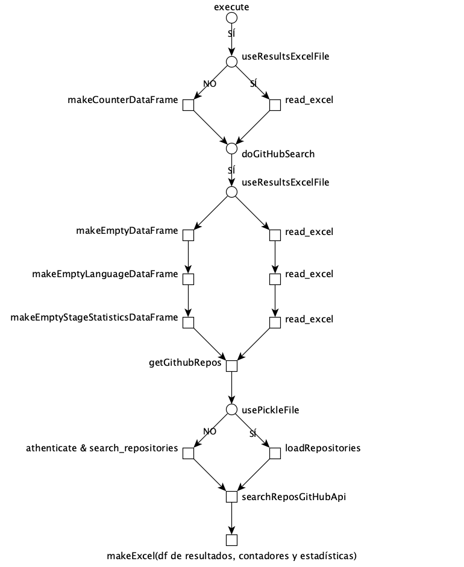
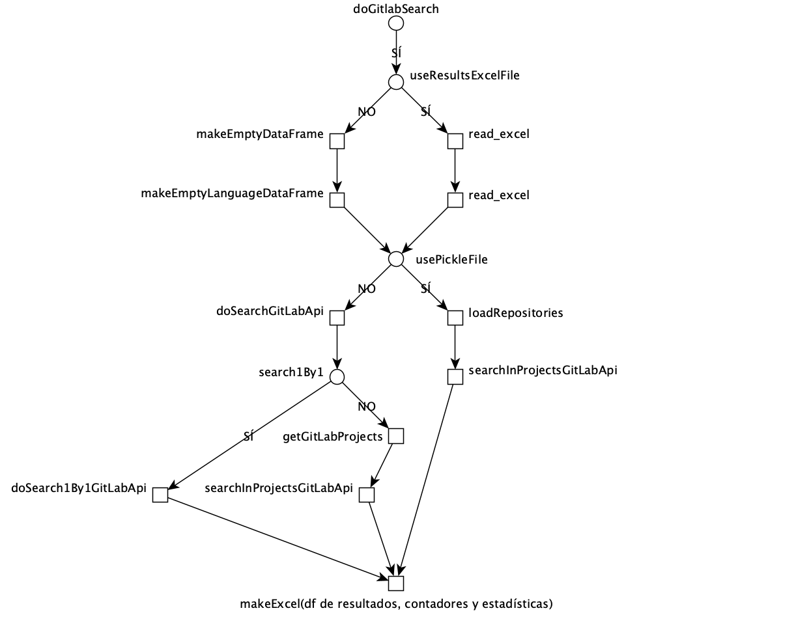

# CIReposFinder
Search for GitHub and GitLab repositories. The aim is to find GitHub and GitLab repositories which use CI/CD tools.

## Set Up 📋

Pre-requisites to reproduce the work:

- Python 3.9
- Git 2.32+

Install Python libraries

```
$ pip install -r requirements.txt
```

## Diagramas
<p>Flujo de ejecución sobre GitHub:</p>


<p>Flujo de ejecución sobre GitLab:</p>


## Build with 🛠️

* [Visual Studio Code](https://code.visualstudio.com/)

## Authors ✒️

* **Jorge Contreras Padilla** - [jorcontrerasp](https://github.com/jorcontrerasp)

## License 📄

This project is under the license (Apache-2.0 License) - look at the file [LICENSE](https://github.com/jorcontrerasp/BuscadorCIRepos/blob/main/LICENSE) for details.
